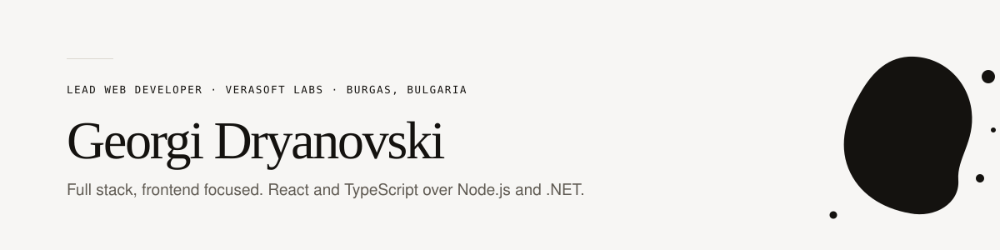

<picture>
  <source media="(prefers-color-scheme: dark)" srcset="assets/banner-dark.svg">
  
</picture>

  <a href="https://www.linkedin.com/in/georgi-dryanovski">LinkedIn</a> ·
  <a href="mailto:georgidrianovski@abv.bg">georgidrianovski@abv.bg</a> ·
  Burgas, Bulgaria

---

Full stack software engineer with **6 years** building and scaling web, mobile and desktop
products — professionally since 2022, with earlier engineering roles from 2020. Strongest on
the frontend, writing fast, polished React and TypeScript interfaces backed by Node.js
and .NET services. Comfortable across the full lifecycle: architecting reliable systems,
shipping features that hold up under real load, owning CI/CD and releases, and applying AI
and automation to speed up how software gets built.

---

## Experience

### Lead Web Developer · Verasoft Labs
December 2022 – Present · Remote

Lead the strategy, development and optimization of the **KORVUE** and **FitVue** platforms —
commercial products for the salon, spa and wellness sector, shipped across web, mobile and
desktop from a shared codebase and in continuous development since 2000.

- Drive system architecture and development workflows to keep the platforms fast, scalable
  and reliable as they grow, with a strong focus on user experience.
- Rebuild the oldest Sencha Touch 2 modules, and parts of the Ionic and Angular layers, on
  Flutter — while the product stays in service, so new modules interoperate with the
  generations they replace rather than landing as a clean break.
- Maintain and extend the React applications that carry current feature work.
- Own CI/CD pipelines and app deployment end to end, making releases across all major
  platforms repeatable and low risk.
- Produce client facing documentation that improves usability and adoption while reducing
  support load.

<kbd>Flutter</kbd> <kbd>React</kbd> <kbd>TypeScript</kbd> <kbd>Angular</kbd> <kbd>Ionic</kbd> <kbd>Sencha&nbsp;Touch</kbd> <kbd>Capacitor</kbd> <kbd>Electron</kbd> <kbd>CI/CD</kbd>

### Independent / Freelance Software Engineer
2022 – Present · Remote

Production grade web, mobile and enterprise applications for business clients across several
industries, owned from architecture through deployment and ongoing maintenance.

- Designed and built **Citron**, an ERP platform that replaces a business's separate CRM,
  sales, finance, inventory and operations tools with a single AI powered system, including
  invoicing, analytics and a restaurant point of sale module.
- Engineered it for scale and maintainability: a modular Node.js and .NET service layer, a
  normalized SQL Server schema with role based access control across user tiers, and a
  React and TypeScript frontend built on reusable component libraries.
- Implemented real time data synchronization, automated reporting and analytics dashboards,
  and third party integrations — replacing manual, error prone back office processes with
  automated workflows.
- Set engineering standards across projects: CI/CD, code review, testing and documentation.
- Led client discovery and technical scoping, translating ambiguous business requirements
  into clear specifications and delivered products.

<kbd>React</kbd> <kbd>TypeScript</kbd> <kbd>Node.js</kbd> <kbd>.NET</kbd> <kbd>SQL&nbsp;Server</kbd>

### Team Lead · IGS Production EOOD
December 2021 – August 2022 · Remote

- Managed a team of developers building web based educational games for the Polish education
  system.
- Directed project execution end to end, delivering scalable, responsive content on time.
- Mentored and guided developers to raise technical quality across all projects.

<kbd>JavaScript</kbd> <kbd>Unity</kbd> <kbd>WebGL</kbd>

---

## Published libraries

React and design token libraries I build and publish to npm — versioned, used by shipping
applications, and open to read.

A design token system built on Style Dictionary that compiles one source of truth to CSS
custom properties, SCSS, JS and JSON; an accessible token driven React component library;
and a React UI library shipped as parallel ESM and CJS builds with generated types.

---

## Technical skills

| | |
| --- | --- |
| **Frontend** | JavaScript (ES6+), TypeScript, React, Redux, Angular, Storybook, Tailwind CSS, Sass / Less, Bootstrap, Ext JS, Sencha Touch |
| **Backend** | Node.js, Express, .NET, C#, C++ · REST and GraphQL APIs, Swagger / OpenAPI |
| **Databases** | Microsoft SQL Server, Firebase (Realtime Database, Firestore) |
| **Mobile & desktop** | Flutter, Ionic, Cordova, Capacitor, Xamarin, Electron, WinForms |
| **DevOps & tooling** | Git, CI/CD pipelines, AWS, Vercel, Vite, Firebase Hosting, Ubuntu server management |
| **CMS & e-commerce** | WordPress, WooCommerce, headless CMS |
| **Practices** | Agile and Scrum, code review, testing, technical documentation, client discovery and scoping, team leadership |

---

<b>Education and certificates</b>

 

**B.Sc. Software Engineering** *(in progress)* — Burgas Free University, Bulgaria

**Vocational School of Computer Programming and Innovation** — Burgas, graduated 2024 · EQF Level 3

Microsoft Technology Associate — Introduction to Programming using HTML and CSS (2020) ·
Microsoft Technology Associate — Introduction to Programming using JavaScript (2021) ·
Microsoft Office Specialist — Word 2016 (2020) ·
Adobe Certified Professional — Graphic Design and Illustration using Illustrator (2022) ·
Adobe Certified Professional — Visual Design using Photoshop (2022) ·
Adobe Certified Professional — Visual Design (2022)

All credentials verifiable at certiport.com

---

Bulgarian — Native · English — C1 · German — A2
